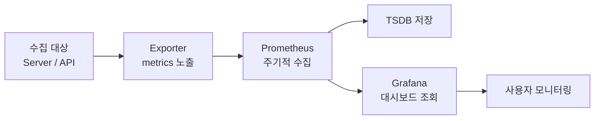
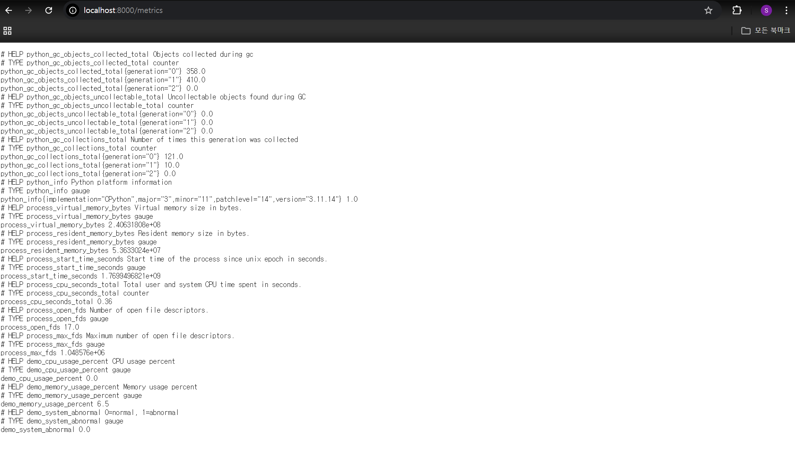
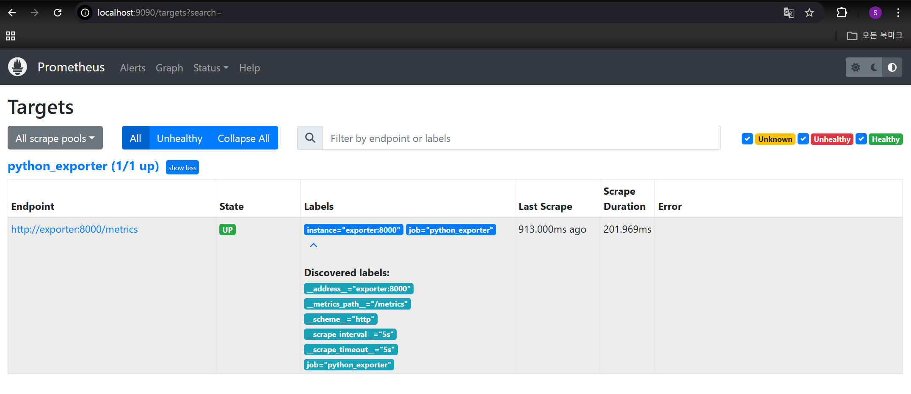
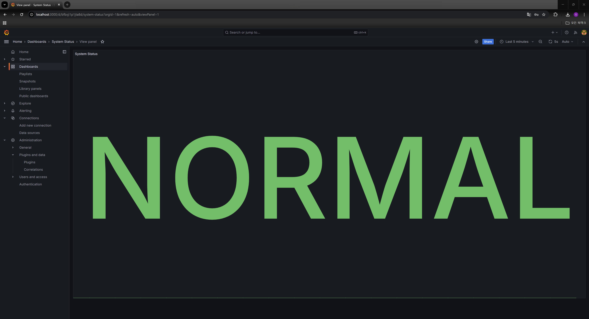
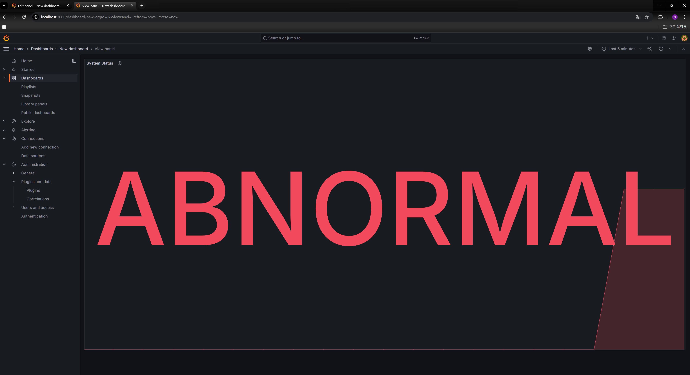
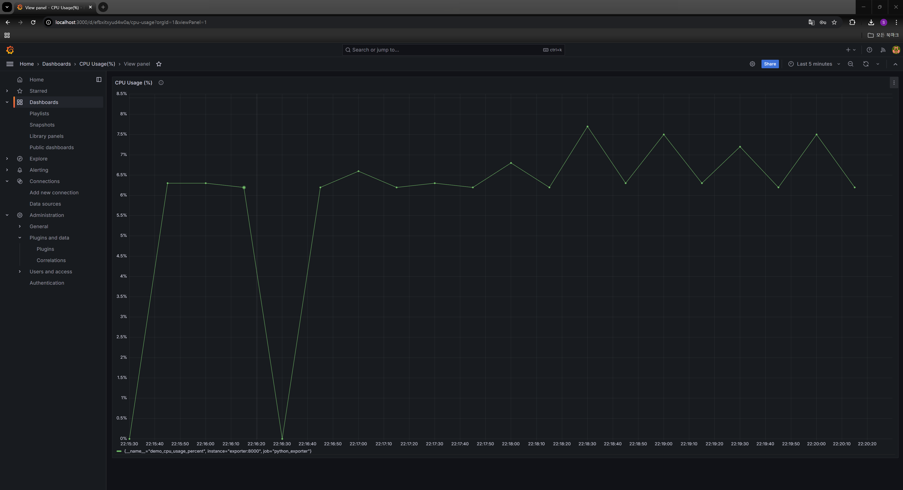
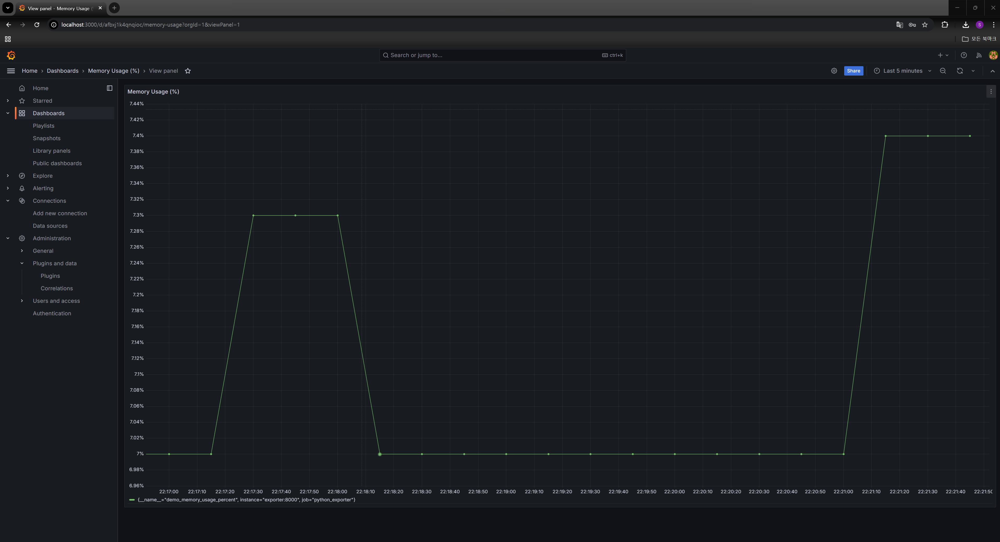
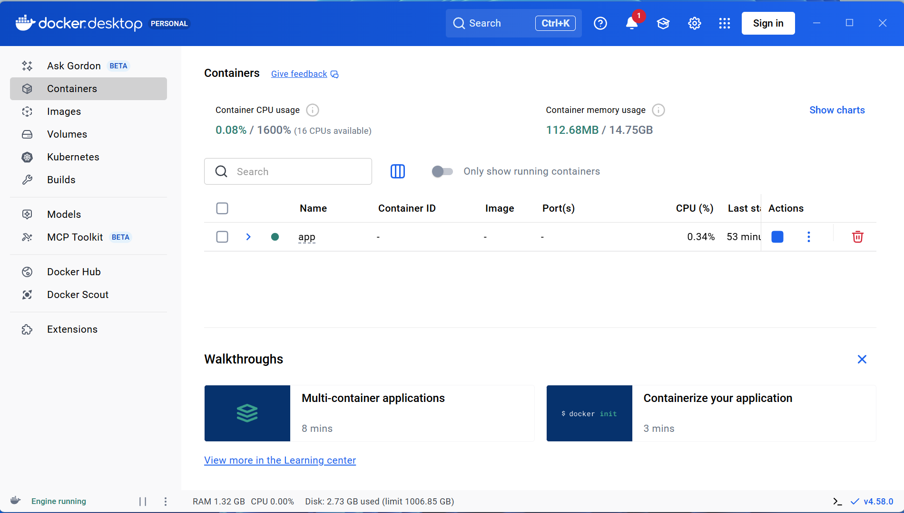

# 시스템 설명 문서

## 1. 오픈소스 구성
- 수집: Python(FastAPI) exporter, Prometheus
- 저장: Prometheus TSDB
- 시각화: Grafana
---
## 2. 수집 지표
- demo_cpu_usage_percent: CPU 사용률(%)
- demo_memory_usage_percent: 메모리 사용률(%)
- demo_system_abnormal: 시스템 상태 (0=정상, 1=비정상)
---
## 3. 시스템 구조

### 3-1. 시스템 구조 설명

- 본 시스템은 Exporter → Prometheus → Grafana 구조로 구성된다.  
- Exporter가 시스템 상태를 metrics 형태로 노출하면 Prometheus가 주기적으로 이를 수집하여 내장 TSDB에 저장한다.  
- Grafana는 Prometheus를 데이터소스로 사용하여 수집된 데이터를 시각화하며, 사용자는 대시보드를 통해 시스템 상태를 확인한다.
---
## 4. 이상 상황 재현 방법

본 시스템은 CPU 및 시스템 상태 메트릭 변화를 통해 비정상 상태를 인지할 수 있도록 구성하였다.  
다음 절차를 통해 이상 상황을 인위적으로 발생시키고 모니터링 동작을 확인하였다.

---

### 4.1 Exporter 정상 동작 확인

Exporter에서 메트릭이 정상 노출되는지 확인한다.

접속 주소:
http://localhost:8000/metrics

Prometheus 형식의 메트릭이 출력되며, CPU/Memory 및 시스템 상태 값이 포함되는 것을 확인하였다.

---

### 4.2 Prometheus 수집 상태 확인

Prometheus Targets 화면에서 Exporter가 정상 수집되는지 확인한다.

접속 주소:
http://localhost:9090/targets

State가 **UP** 상태로 표시되어 정상적으로 Pull 수집이 이루어짐을 확인하였다.

---

### 4.3 정상 상태 확인 (NORMAL)

시스템이 정상 상태일 때 `demo_system_abnormal = 0` 값이 유지된다.

Grafana 대시보드에서 상태가 정상으로 표시된다.

---

### 4.4 비정상 상태 재현 (ABNORMAL)

CPU 부하를 발생시키거나 비정상 상태 값을 변경하여 시스템 이상 상황을 발생시켰다.

예시:
- CPU 사용률 증가
- abnormal 상태값 = 1 변경

비정상 상태 발생 시 Grafana 대시보드가 경고 상태로 변경된다.

---

### 4.5 리소스 사용량 변화 확인

CPU 및 메모리 사용량 변화가 시계열 그래프로 반영되는지 확인하였다.

CPU 사용률 변화:

메모리 사용률 변화:

Prometheus가 주기적으로 수집한 데이터가 Grafana에 정상적으로 반영되는 것을 확인하였다.

---

### 4.6 컨테이너 실행 환경 확인

Docker 환경에서 모니터링 시스템이 실행 중임을 확인하였다.

