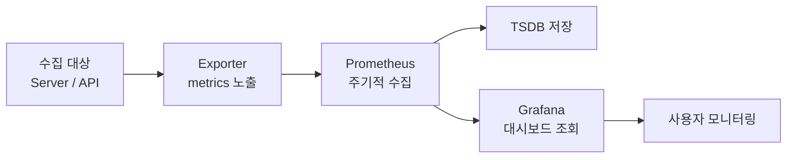

# 시스템 설명 문서

## 1. 오픈소스 구성
- 수집: Python(FastAPI) exporter, Prometheus
- 저장: Prometheus TSDB
- 시각화: Grafana

## 2. 수집 지표
- demo_cpu_usage_percent: CPU 사용률(%)
- demo_memory_usage_percent: 메모리 사용률(%)
- demo_system_abnormal: 시스템 상태 (0=정상, 1=비정상)

## 시스템 구조

### 시스템 구조 설명
본 시스템은 Exporter → Prometheus → Grafana 구조로 구성된다.  
Exporter가 시스템 상태를 metrics 형태로 노출하면 Prometheus가 주기적으로 이를 수집하여 내장 TSDB에 저장한다.  
Grafana는 Prometheus를 데이터소스로 사용하여 수집된 데이터를 시각화하며, 사용자는 대시보드를 통해 시스템 상태를 확인한다.
